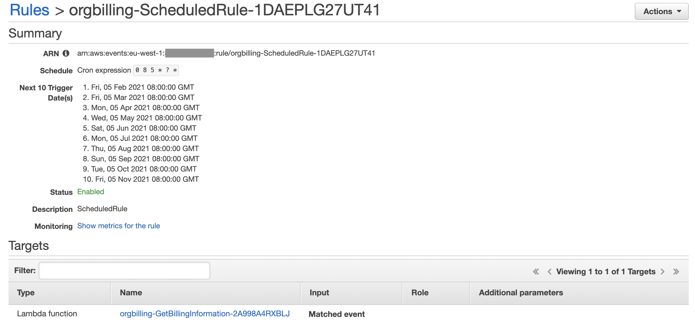

# Cost Reporting Based on AWS Organizations Account ID Tags
This is the repository mentioned in the [Cost Reporting Based on AWS Organizations Account ID Tags]() blog post. It is a wrap-up of the blog post content and contains the AWS CloudFormation template as well as the AWS Lambda function code to deploy the solution. It also provides a high level overview and describes the steps needed to deploy the solution manually.
## Introduction
Cost control and visibility in multi-account environments are very important topics and relevant to almost all customers. Many customers are using [AWS Cost Explorer](https://aws.amazon.com/aws-cost-management/aws-cost-explorer/) or [AWS Cost & Usage Reports](https://aws.amazon.com/aws-cost-management/aws-cost-and-usage-reporting/) and use [cost allocation tags](https://docs.aws.amazon.com/awsaccountbilling/latest/aboutv2/cost-alloc-tags.html) to filter / analyse spend on resources based on custom metadata. But customers may also want to track cost on an AWS account level and run further analysis or build reports from account based, custom metadata. The following graphic shows different locations where tags can be added.


Today it is not possible for customers to run and build reports based on tags in their AWS account structure in AWS Organizations via AWS Cost Explorer or AWS Cost & Usage Reports.

This example solution demonstrates how to retrieve Account information including tags from AWS Organizations, how to get cost details from the AWS Cost Explorer API and store this information in a CSV file in Amazon S3.

## Architecture overview
The following diagram shows the architecture that consists of the following parts:
1. Amazon CloudWatch Events task that calls an AWS Lambda function on a monthly basis
2. The AWS Lambda function queries AWS Organizations for all AWS account ID's 
3. Reads the defined tags per Acocunt
4. Retrieves monthly cost per account via the AWS Cost Explorer API
5. Store the data in Amazon S3

NOTE: The solution has to be deployed in the AWS Organizations Management account.


## Prerequisites
For this solution to work, you should have the following prerequisites: 
- An AWS account
- AWS Organizations setup via AWS Control Tower or Manually
- Admin user in your AWS Organizations Management account
- AWS CLI configured and setup
- An S3 bucket where you can upload the AWS Lambda function code

### Add Tags to your AWS Accounts
This example solution uses 3 AWS account tags in order to work. You have to add these tags to your AWS accounts in AWS Organizations but you can modify them if you’re updating the code of the AWS Lambda function accordingly.
1. Log in to the AWS Console using your admin user in the AWS Organizations Master Account
2. Open AWS Organizations
3. Select one of your AWS accounts and add the following 3 tags and provide some sample data:
    - “Cost Center”
    - “Project”
    - “Owner”


4. Repeat the previous step for other accounts
5. Leave AWS Organizations and go back to the AWS Console

Please note that these tags are examples. You can modify and delete/add more tags to your accounts but you’ve to modify the Lambda function code as well if you would like to capture them in the output file.
## Deployment
NOTE: The CloudFormation template provided will create all resources necessary. It does not create the Amazon S3 bucket needed to store the AWS Lambda function source code. Please make sure you have this created before you proceed.

Let's go aheand and walk through the steps needed in order to deploy this solution. Please clone this repository.
### Upload contents to Amazon S3
In order to deploy the solution, you need to upload the AWS CloudFormation template and the AWS Lambda function code to Amazon S3. Please replace the `<your-S3-Bucket-name>`secsions with your bucket name.

1. Create a .ZIP file that contains the AWS Lambda function from this repository.
    ```bash
    cd src/
    zip org-billing-lambda-function.zip lambda_function.py
    ```
2. Upload the AWS Lambda .ZIP file to your Amazon S3 bucket
   ```bash
   aws s3 cp org-billing-lambda-function.zip s3://<your-S3-Bucket-name>/ --acl public-read
   ```
3. Upload the AWS CloudFormation template to the same Amazon S3 bucket
   ```bash
   aws s3 cp org-billing-cloudformation.yaml s3://<your-S3-Bucket-name>/ --acl public-read
   ```
   NOTE: you may need to add a  `--profile` and `--region` parameter depending on your configuration. Please check the [AWS CLI](https://docs.aws.amazon.com/cli/latest/userguide/cli-configure-options.html) documentation.
### Deploy AWS CloudFormation template
Deploy the [AWS CloudFormation template](src/org-billing-cloudformation.yaml) referenced below in your AWS Management account. This will provision all resources needed like Amazon CloudWatch Event, IAM Policies and Role, AWS Lambda function and Amazon S3 output bucket. Please replace the `<your-S3-Bucket-name>`sections with your bucket name.

1.	Run the following command in order to create a new AWS CloudFormatino stack.
    ```bash
    aws cloudformation create-stack --stack-name org-billing --template-url https://s3.amazonaws.com/<your-S3-bucket-name>/org-billing-cloudformation.yaml --capabilities CAPABILITY_IAM --parameters ParameterKey=SourceBucket,ParameterValue=<your-S3-Bucket-name> ParameterKey=SourceCodeFile,ParameterValue=org-billing-lambda-function.zip
    ```
2. Check the execution status on the AWS console and review the “Resources” section of your Amazon CloudWatch Stack once the deployment is finished, take a note of the S3 bucket that has been created. This is where your billing information will be stored.

## Check the solution
### Review Amazon CloudWatch Event
The CloudFormation template will setup a Amazon CloudWatch Event which triggers the AWS Lambda function once a month. You can modify the cron schedule and adjust it to your needs. If it’s run more frequently than once a month, the file in Amazon S3 will be overwritten with the same information.


### Executing the AWS Lambda function
The AWS Lambda function is scheduled via a Amazon CloudWatch Events cron schedule. If you want to execute the AWS Lambda function on demand, please do the following:
1.	In the AWS Console in the services search enter and “Lambda” and click select.
2.	Open the Lambda function (you can see its name in the resources section in AWS CloudFormation).
3.	In the Lambda function main section click on “Test”.
4.	On the “Configure Test Event” enter an Event Name, screen scroll down and click on “Create”. The AWS Lambda function does not need any input, that’s why you don’t have to specify an input event.
5.	Back on the AWS Lambda function make sure you’ve selected your test event and click on “Test”. This will run the AWS Lambda function and you should see “Execution result: succeeded”.
If you’d like to modify or enhance the AWS Lambda function, please check out the source code from the GitHub repository.

### Check Output
Let’s check the Amazon S3 bucket and review the output file:
1.	In the AWS Console in the services search enter and “S3” and click select.
2.	Open the Amazon S3 output bucket.
3.	Select the file starting with “costinformation-YYYY-MM-DD.csv” and click on “Actions” and “Download”.
4.	Open the file locally.
  
 
You will see a table like listed in the example below including the tags that you’ve added to the accounts in AWS Organizations.

## Conclusion
This example solution demonstrates how you could query your AWS account data from AWS Organizations including their tags, query Cost Explorer API and store the result in S3. The output contains the monthly spent per account and has the additional metadata from AWS Organizations stored as well. It is meant to be an easy example to show you the way how you can get started. You can also enhance the sample code according to your needs, for example to analyze data based on Organizational Units. You can also use the output data to run further analysis by using Amazon Athena, AWS Glue and Amazon Quicksight.

## Security

See [CONTRIBUTING](CONTRIBUTING.md#security-issue-notifications) for more information.

## License

This library is licensed under the MIT-0 License. See the LICENSE file.